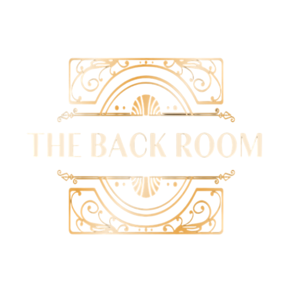

Welcome to [The Back Room](https://the-back-room.info), a hub for open-source projects, custom themes, and software tweaks. Our mission is to provide high-quality resources for users looking to enhance their digital experience. We focus on creating and curating tools that allow users to customize their operating systems, applications, and overall user interface.

This repository hosts the documentation for The Back Room website, including guides, tutorials, and information about our projects. Feel free to explore the various sections and contribute to the content! You can find our contributing guidelines [here](./Contributing).