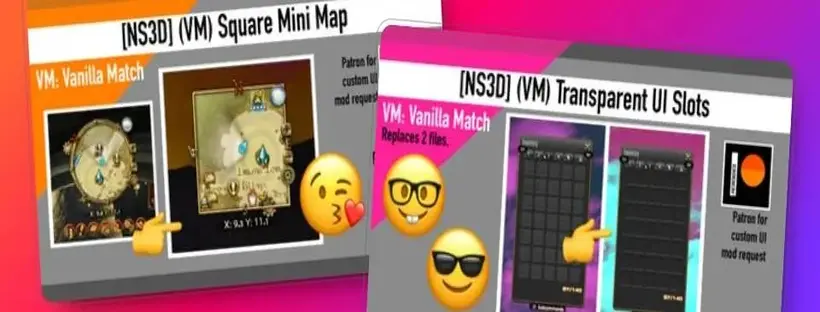

<!-- 
{: .note }
> {: .opaque }
> 
>
> 
-->

{: .important }
> {: .opaque }
> {: .warning }
> Using mods in any shape or way violates section 2.1 of the Final Fantasy XIV User Agreement and can lead to your service account being terminated and/or banned by SQUARE ENIX.
>
> We take **NO** responsibility for anyone who loses their account due to the use of mods. Use of mods in Final Fantasy XIV is done **AT YOUR OWN RISK**.

  
  

    <h2 class="text-small" style="text-align:center">Lustful Eyes</h2>
    
Lustful eyes for all races. Let your inner OwO or Yandare take over!

     
    <h2 class="text-small" style="text-align:center">Download</h2>
     
    
      

        <a href="https://www.nexusmods.com/finalfantasy14/mods/2401" target="_blank">
          <button type="button" name="button" class="btn">Nexus Mods</button></a> 
        <a href="https://heliosphere.app/mod/w7xhfe6s7h0tbc96279yz1eb1g" target="_blank">
          <button type="button" name="button" class="btn">Heliosphere</button></a> 
        <a href="https://www.xivmodarchive.com/modid/120843" target="_blank">
          <button type="button" name="button" class="btn">XIV Mod Archive</button></a> 
      

    
     
  

 

  
  

    <h2 class="text-small" style="text-align:center">[NS3D] (VM) UI Pack</h2>
    
A simple and minimalistic UI mod that cleans up the UI without making a whole lot of unnecessary changes.

     
    <h2 class="text-small" style="text-align:center">Download</h2>
     
    
      

        <a href="https://www.nexusmods.com/finalfantasy14/mods/2402" target="_blank">
          <button type="button" name="button" class="btn">Nexus Mods</button></a> 
        <a href="https://heliosphere.app/mod/hrsbv17zxh55567hsseaz4cbf8" target="_blank">
          <button type="button" name="button" class="btn">Heliosphere</button></a> 
        <a href="https://www.xivmodarchive.com/modid/125248" target="_blank">
          <button type="button" name="button" class="btn">XIV Mod Archive</button></a> 
      

    
     
  

 

   
  

    <h2 class="text-small" style="text-align:center">Roseblood Duelist</h2>
    
Because it's just a better overall look!

     
    <h2 class="text-small" style="text-align:center">Download</h2>
     
    
      

        <a href="https://www.nexusmods.com/finalfantasy14/mods/2411" target="_blank">
          <button type="button" name="button" class="btn">Nexus Mods</button></a> 
        <a href="https://heliosphere.app/mod/5w9m2enmw16ys40x0v310v269m" target="_blank">
          <button type="button" name="button" class="btn">Heliosphere</button></a> 
        <a href="https://www.xivmodarchive.com/modid/137286" target="_blank">
          <button type="button" name="button" class="btn">XIV Mod Archive</button></a>
      

    
     
  

