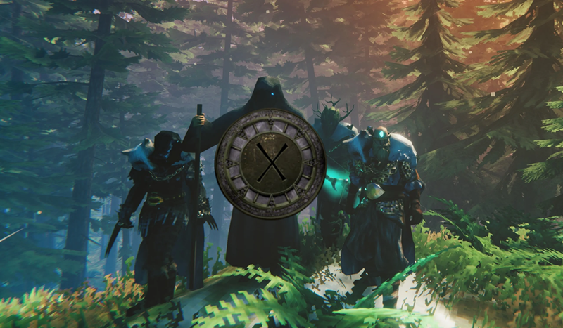

  
  

    <h2 class="text-small" style="text-align:center">Odinheim</h2>
    
A collection of mods to improve gameplay. Contains both client-side and server-side mods.

     
    <h2 class="text-small" style="text-align:center">Download</h2>
     
    
      

        <a href="https://thunderstore.io/c/valheim/p/Nimbi/Odinheim/" target="_blank">
          <button type="button" name="button" class="btn">Thunderstore</button></a> 
        <a href="https://heliosphere.app/mod/5w9m2enmw16ys40x0v310v269m" target="_blank">
          <button type="button" name="button" class="btn">Heliosphere</button></a> 
      

    
     
  

