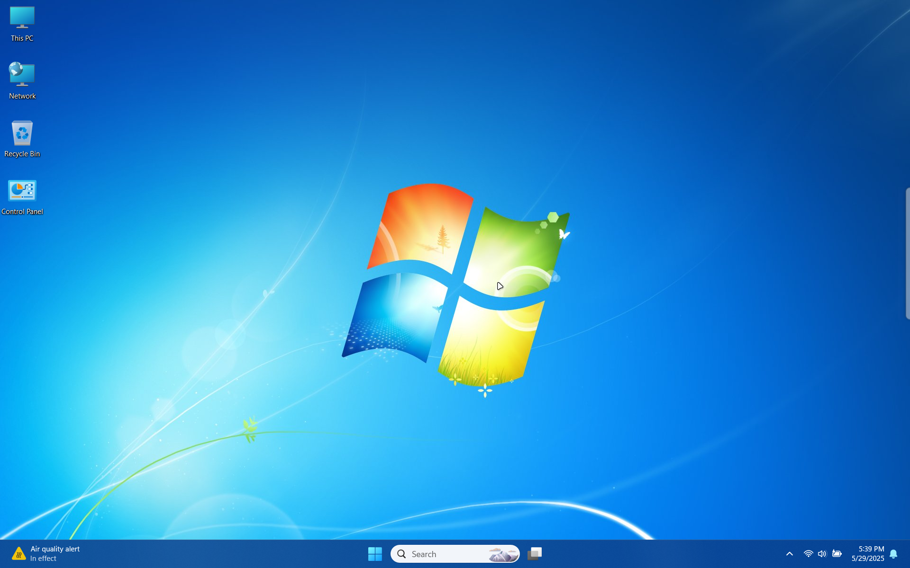
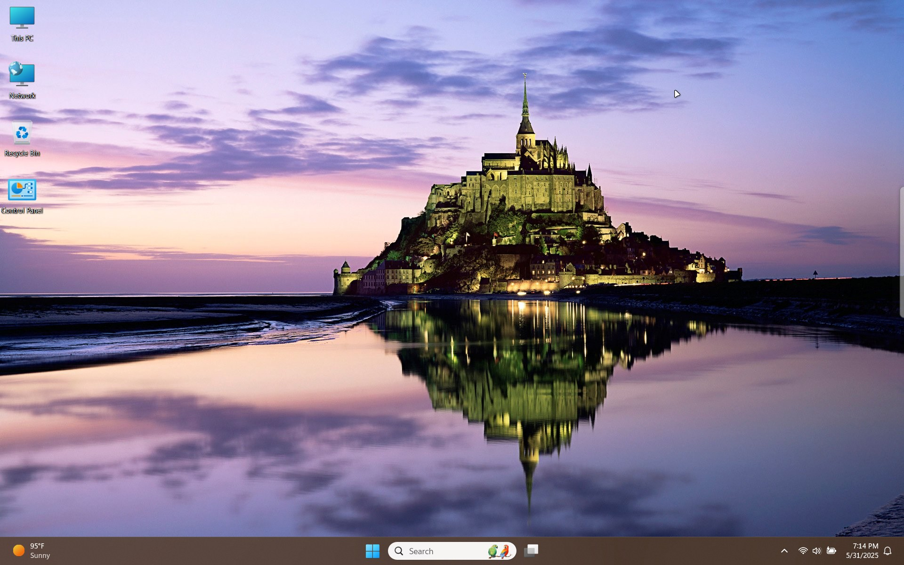
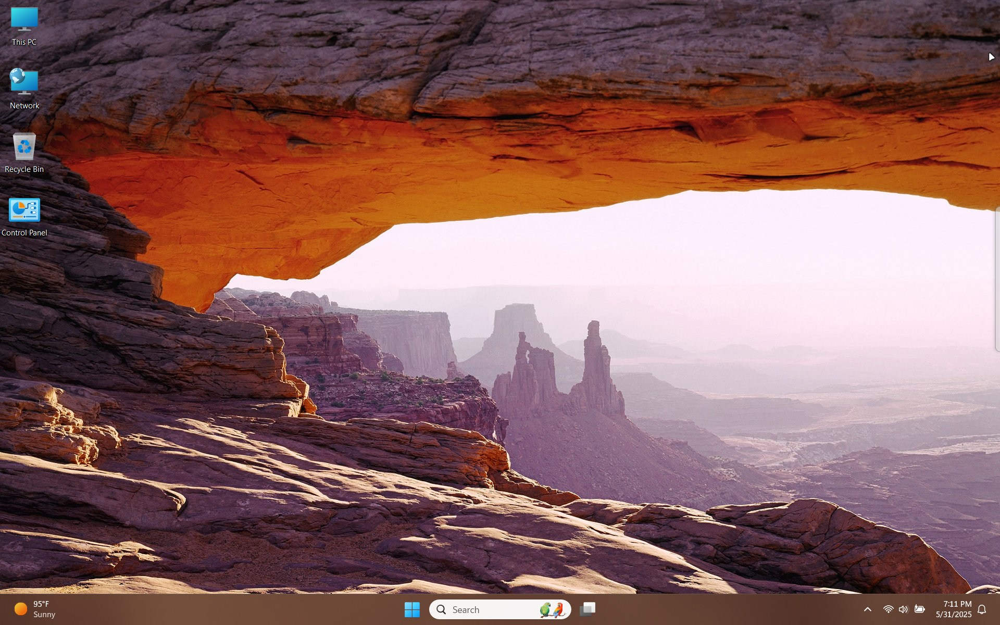
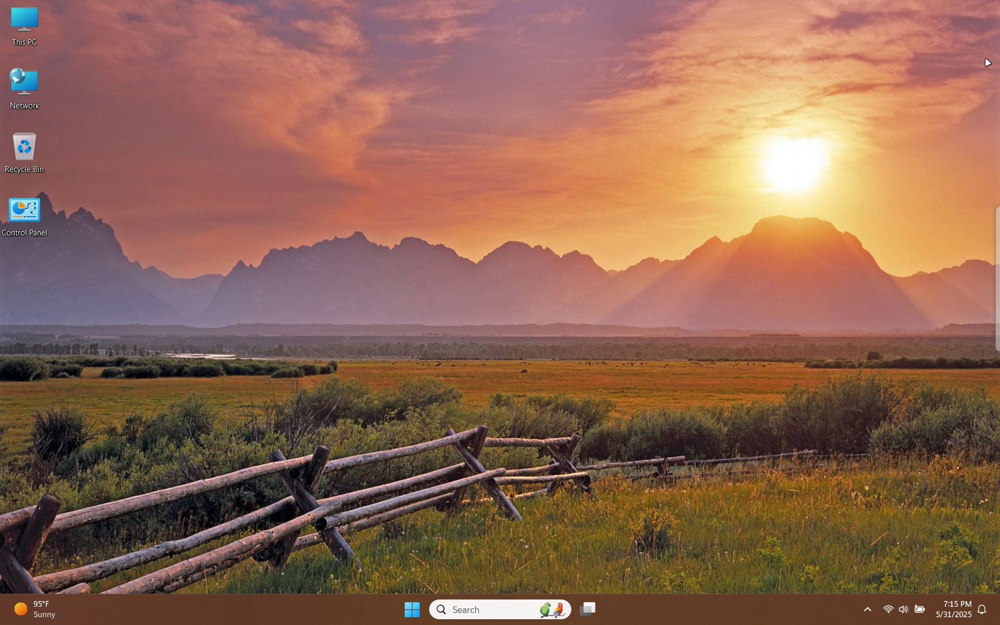
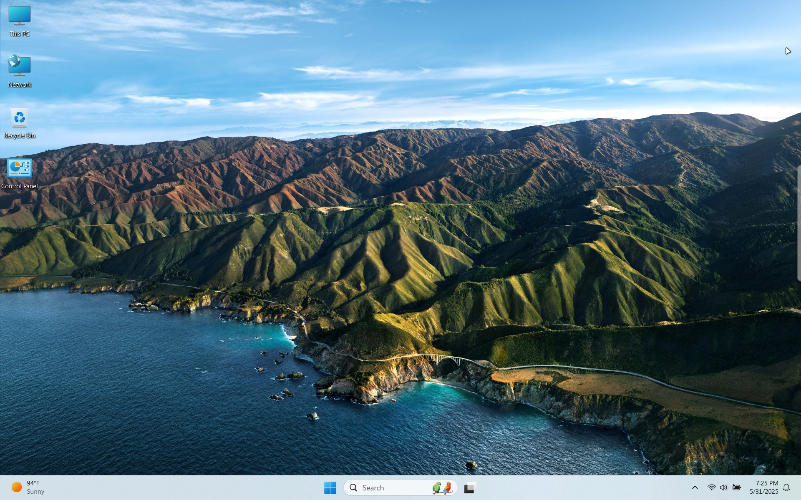
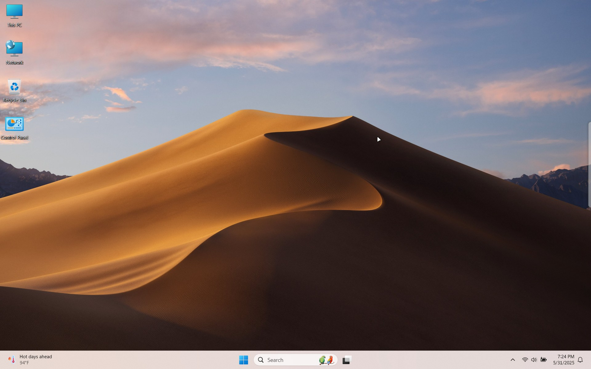
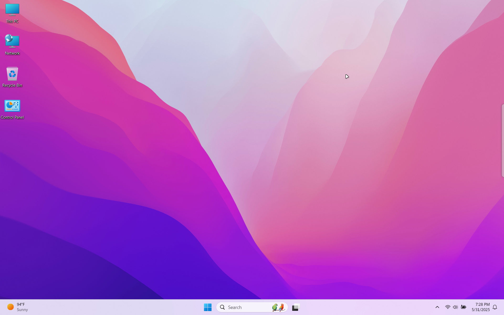
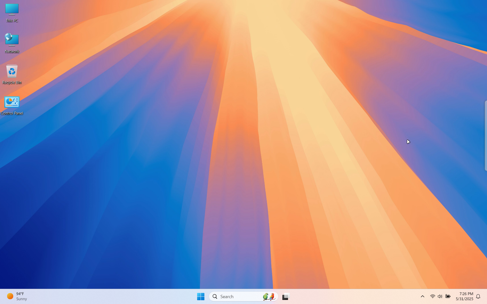

{: .note }
> {: .opaque }
> We have optional SFX Installers for all of our Windows themes.
>
> You can find those on our gitlab page.
> 
> <ul>
>   <li> <a href="https://gitlab.com/the-back-room/Themes/-/tree/main/Windows" target="_blank">GitLab</a></li>
> </ul>

<h2 class="text-small" style="text-align:center">Windows 11 Hidden EDU Themes</h2>

Windows 11 hidden EDU themes ported for all Windows 10 and 11 users.
 
Contains all 6 EDU themes.

 

<a href="https://gitlab.com/the-back-room/Themes/-/archive/main/Themes-main.zip?path=Windows/SFW/Windows-11-Hidden-EDU-Themes" target="_blank">
<button type="button" name="button" class="btn">Download</button></a> 

 

<h2 class="text-small" style="text-align:center">Classic 11</h2>

 

<a href="https://gitlab.com/the-back-room/Themes/-/archive/main/Themes-main.zip?path=Windows/SFW/Classic-11" target="_blank">
<button type="button" name="button" class="btn">Download</button></a> 

 

<h2 class="text-small" style="text-align:center">Copilot</h2>

 

<a href="https://gitlab.com/the-back-room/Themes/-/archive/main/Themes-main.zip?path=Windows/SFW/Microsoft-Copilot" target="_blank">
<button type="button" name="button" class="btn">Download</button></a> 

 

<h2 class="text-small" style="text-align:center">Surface Pro</h2>

 

<a href="https://gitlab.com/the-back-room/Themes/-/archive/main/Themes-main.zip?path=Windows/SFW/Microsoft-Surface-Pro" target="_blank">
<button type="button" name="button" class="btn">Download</button></a> 

 

<h2 class="text-small" style="text-align:center">Windows 7 Revived</h2>

Collection of stock Windows 7 themes restored for Windows 10 and 11.
 
Contains over 40+ themes.

 

<a href="https://gitlab.com/the-back-room/Themes/-/archive/main/Themes-main.zip?path=Windows/SFW/Windows-7-Revived" target="_blank">
<button type="button" name="button" class="btn">Download</button></a> 

 

<h2 class="text-small" style="text-align:center">Courage TCD</h2>

 

<a href="https://gitlab.com/the-back-room/Themes/-/archive/main/Themes-main.zip?path=Windows/SFW/Courage-TCD" target="_blank">
<button type="button" name="button" class="btn">Download</button></a> 

 

<h2 class="text-small" style="text-align:center">Howl's Moving Castle</h2>

 

<a href="https://gitlab.com/the-back-room/Themes/-/archive/main/Themes-main.zip?path=Windows/SFW/Howls-Moving-Castle" target="_blank">
<button type="button" name="button" class="btn">Download</button></a> 

 

<h2 class="text-small" style="text-align:center">Studio Ghibli</h2>

 

<a href="https://gitlab.com/the-back-room/Themes/-/archive/main/Themes-main.zip?path=Windows/SFW/Studio-Ghibli" target="_blank">
<button type="button" name="button" class="btn">Download</button></a> 

 

<h2 class="text-small" style="text-align:center">MacOS Themes for Windows</h2>

Collection of MacOS themes ported to Windows 10 and 11.
 
Contains over 20+ themes.

 

<a href="https://gitlab.com/the-back-room/Themes/-/archive/main/Themes-main.zip?path=Windows/SFW/MacOS-Themes-for-Windows" target="_blank">
<button type="button" name="button" class="btn">Download</button></a> 

 

<!-- ////////////////////////////////////////////////////////////////////////////////////////////////////////////////////// -->
 
<a href="/themes/windows/nsfw">
<button type="button" name="button" class="btn">NSFW Themes</button></a> 
 
<!-- ////////////////////////////////////////////////////////////////////////////////////////////////////////////////////// -->