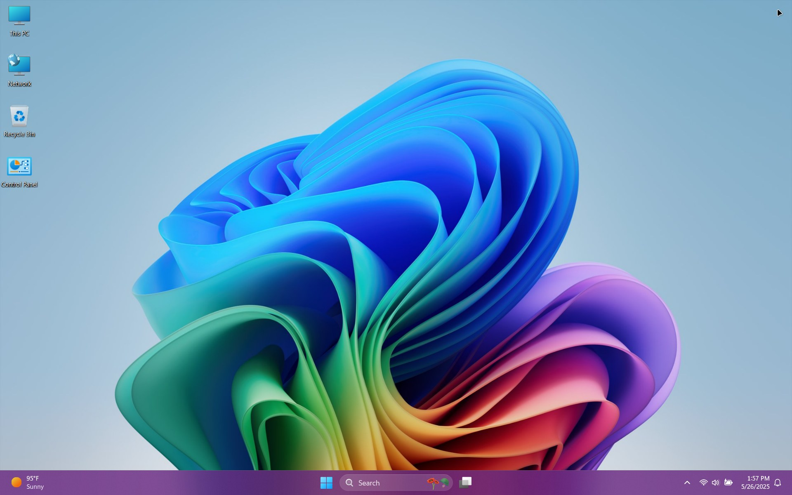
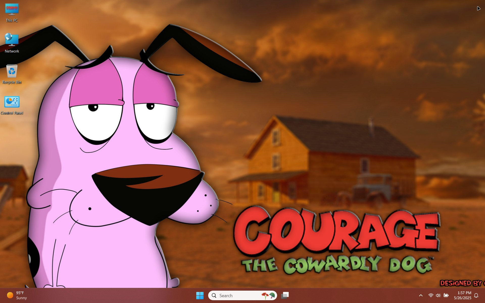
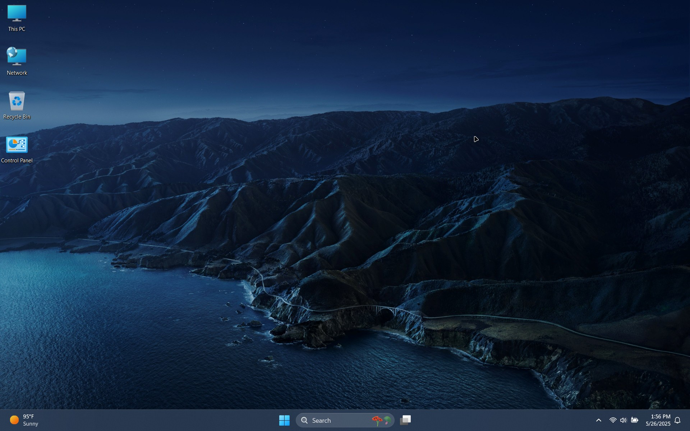
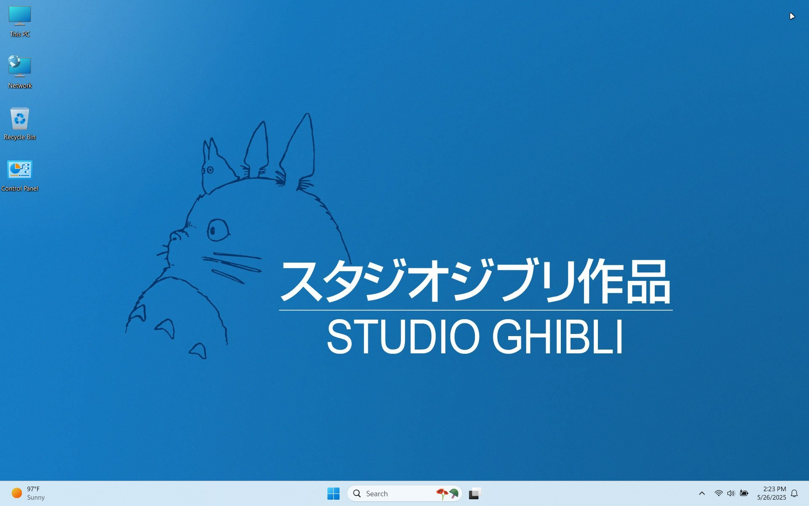
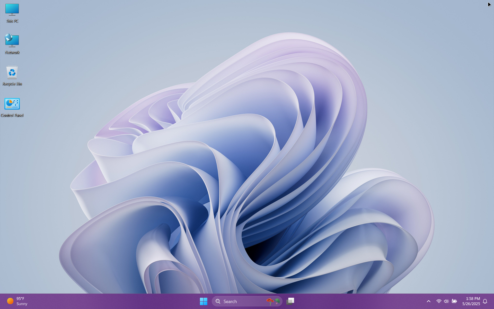

{: .note }
> {: .opaque }
> We have optional SFX Installers for all of our Windows themes.
>
> You can find those on our gitlab page.
> 
> <ul>
>   <li> <a href="https://gitlab.com/the-back-room/Themes/-/tree/main/Windows" target="_blank">GitLab</a></li>
> </ul>

    

        

            
1 / 6

            
            
Flower Light

        

        

            
2 / 6

            
            
Flower Dark

        

        

            
3 / 6

            
            
Planets Light

        

        

            
4 / 6

            
            
Planets Dark

        

        

            
5 / 6

            
            
Sunset Light

        

        

            
6 / 6

            
            
Sunset Dark

        

    

    

        <h2 class="text-small" style="text-align:center">Windows 11 Hidden EDU Themes</h2>
        
Windows 11 Hidden EDU Themes for all to enjoy.

         
        
            

                <a href="https://gitlab.com/the-back-room/Themes/-/archive/main/Themes-main.zip?path=Windows/SFW/Windows-11-Hidden-EDU-Themes" target="_blank">
                <button type="button" name="button" class="btn">Download</button></a> 
            

        
         
    

 

    
     
    

        <h2 class="text-small" style="text-align:center">Classic 11</h2>
        
Simple Windows 11 theme with a classic style reminiscent of the Windows 7 era

         
        
            

                <a href="https://gitlab.com/the-back-room/Themes/-/archive/main/Themes-main.zip?path=Windows/SFW/Classic-11" target="_blank">
                <button type="button" name="button" class="btn">Download</button></a> 
            

        
         
    

 

    
     
    

        <h2 class="text-small" style="text-align:center">Copilot</h2>
        
Microsoft's <b>Copilot</b> inspired theme for all to enjoy

         
        
            

                <a href="https://gitlab.com/the-back-room/Themes/-/archive/main/Themes-main.zip?path=Windows/SFW/Microsoft-Copilot" target="_blank">
                <button type="button" name="button" class="btn">Download</button></a> 
            

        
         
    

 

    
     
    

        <h2 class="text-small" style="text-align:center">Courage TCD</h2>
        
A tribute to a cult classic from the early to late 90s

         
        
            

                <a href="https://gitlab.com/the-back-room/Themes/-/archive/main/Themes-main.zip?path=Windows/SFW/Courage-TCD" target="_blank">
                <button type="button" name="button" class="btn">Download</button></a> 
            

        
         
    

 

    
     
    

        <h2 class="text-small" style="text-align:center">Howl's Moving Castle</h2>
        
A tribute to one of Studio Ghibli's highest grossing films

         
        
            

                <a href="https://gitlab.com/the-back-room/Themes/-/archive/main/Themes-main.zip?path=Windows/SFW/Howls-Moving-Castle" target="_blank">
                <button type="button" name="button" class="btn">Download</button></a> 
            

        
         
    

 

    
     
    

        <h2 class="text-small" style="text-align:center">MacOS Themes for Windows</h2>
        
MacOS themes ported to Windows 11

         
        
            

                <a href="https://gitlab.com/the-back-room/Themes/-/archive/main/Themes-main.zip?path=Windows/SFW/MacOS-Themes-for-Windows" target="_blank">
                <button type="button" name="button" class="btn">Download</button></a> 
            

        
         
    

 

    
     
    

        <h2 class="text-small" style="text-align:center">Studio Ghibli</h2>
        
A tribute to one of the greatest animation studios of the 20th century

         
        
            

                <a href="https://gitlab.com/the-back-room/Themes/-/archive/main/Themes-main.zip?path=Windows/SFW/Studio-Ghibli" target="_blank">
                <button type="button" name="button" class="btn">Download</button></a> 
            

        
         
    

 

    
     
    

        <h2 class="text-small" style="text-align:center">Surface Pro</h2>
        
Microsoft's <b>Surface Pro</b> themes for all to enjoy

         
        
            

                <a href="https://gitlab.com/the-back-room/Themes/-/archive/main/Themes-main.zip?path=Windows/SFW/Microsoft-Surface-Pro" target="_blank">
                <button type="button" name="button" class="btn">Download</button></a> 
            

        
         
    

 

    
     
    

        <h2 class="text-small" style="text-align:center">Windows 7 Revived</h2>
        
Large scale Windows 7 themes revival project

         
        
            

                <a href="https://gitlab.com/the-back-room/Themes/-/archive/main/Themes-main.zip?path=Windows/SFW/Windows-7-Revived" target="_blank">
                <button type="button" name="button" class="btn">Download</button></a> 
            

        
         
    

<!-- ////////////////////////////////////////////////////////////////////////////////////////////////////////////////////// -->
 

<a href="https://the-back-room.info/themes/windows/nsfw">Click here</a> to check out our NSFW themes.
 
 
<!-- ////////////////////////////////////////////////////////////////////////////////////////////////////////////////////// -->

<!-- ////////////////////////////////////////////////////////////////////////////////////////////////////////////////////// -->