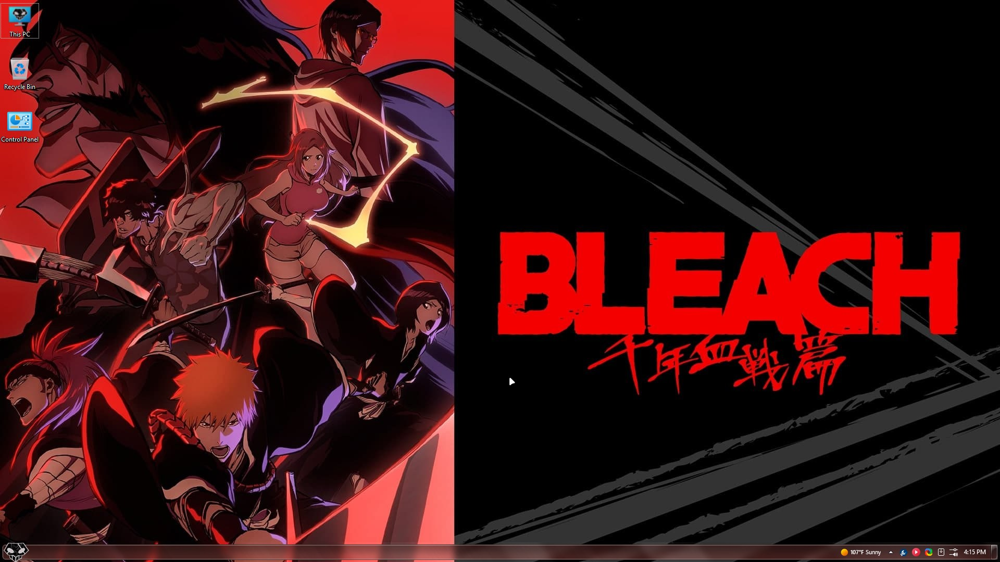
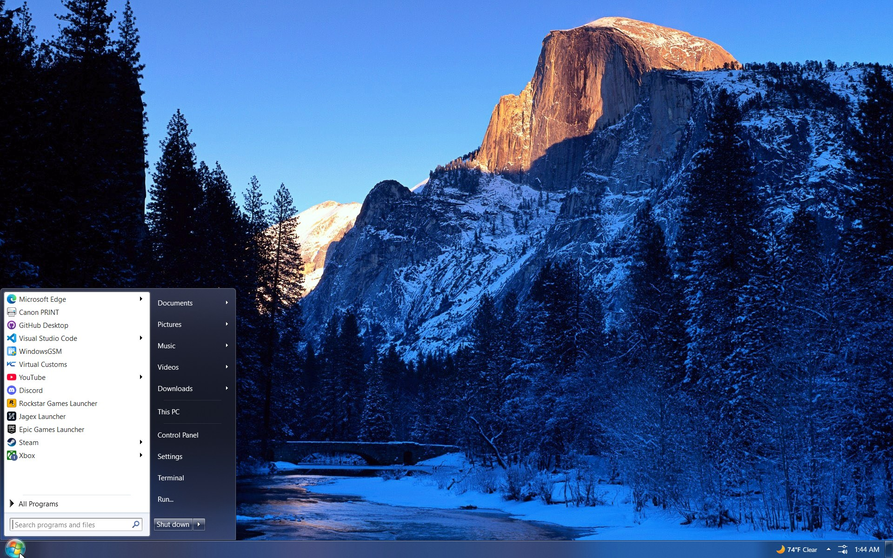

<!-- 
{: .note }
> {: .opaque }
> 
>
> 
-->

{: .important }
> {: .opaque }
> {: .warning }
> These themes are for advanced users who know how to properly patch their systems to run unisgned themes. 
> Patching your system **CAN** and **WILL* brick your system if done wrong.
>
> We take **NO** responsibility for anyone who bricks their system using custom MSSTYLE themes.

    

        
    

    

        <h2 class="text-small" style="text-align:center">BLEACH Themes for Windows 11 23H2+</h2>
         
        
This suite was built using the Open-Source Aero7-11 MSSTYLES for Windows 11. You can find the original source code here: <a href="https://github.com/LittleFox2024/Aero7-11" target="_blank">LittleFox2024/Aero7-11: Aero 7 theme for Windows 11 23H2+</a>

          
        <h4>Requirements</h4>
         
        
<b>WindHawk Plugin</b>: Bring Back the Borders! 
        <b>WindHawk Plugin</b>: Logon, Logoff & Shutdown Sounds Restored 
        <b>WindHawk Plugin</b>: Resource Redirect 
        UltraUxThemePatcher or SecureUxTheme and|or <b>WindHawk Plugin</b>: UxThemeHook 
        StartAllBack or Explorer7 
        OldNewExplorer and|or <b>WindHawk Plugin</b>: Aerexplorer 
        DWMBlurGlass 
        Mica For Everyone

          
        <h4>Themes</h4>
         
        
<b>BLEACH</b> 
        <b>BLEACH</b>: Square 
        <b>BLEACH</b>: Small Title 
        <b>BLEACH</b>: Square - Small Title 
        <b>BLEACH</b>: Thousand Year Blood War 
        <b>BLEACH</b>: Thousand Year Blood War - Square 
        <b>BLEACH</b>: Thousand Year Blood War - Small Title 
        <b>BLEACH</b>: Thousand Year Blood War - Square - Small Title
 
    

     
    
        

            <a href="https://github.com/The-Back-Room/BLEACH-Themes-for-Windows-11/archive/refs/heads/main.zip" target="_blank">
            <button type="button" name="button" class="btn">Download</button></a> 
        

    
     

  

    

        
    

    

        <h2 class="text-small" style="text-align:center">Windows 7 Themes for Windows 11 23H2+</h2>
         
        
This suite was built using the Open-Source Aero7-11 MSSTYLES for Windows 11. You can find the original source code here: <a href="https://github.com/LittleFox2024/Aero7-11" target="_blank">LittleFox2024/Aero7-11: Aero 7 theme for Windows 11 23H2+</a>

          
        <h4>Requirements</h4>
         
        
<b>WindHawk Plugin</b>: Bring Back the Borders! 
        <b>WindHawk Plugin</b>: Logon, Logoff & Shutdown Sounds Restored 
        <b>WindHawk Plugin</b>: Resource Redirect 
        UltraUxThemePatcher or SecureUxTheme and|or <b>WindHawk Plugin</b>: UxThemeHook 
        StartAllBack or Explorer7 
        OldNewExplorer and|or <b>WindHawk Plugin</b>: Aerexplorer 
        DWMBlurGlass 
        Mica For Everyone

          
        <h4>Themes</h4>
         
        
<b>RTM</b>: Windows, Architecture, Nature, Characters, Landscapes, Scenes 
        <b>Regional</b>: Australia, Brazil, Canada, China, France, Germany, India, Italy, Japan, Korea, Mexico, Poland, Russia, Spain, South Africa, Taiwan, United Kingdoms, United States 
        <b>Panoramic</b>: Panoramic Animals, Panoramic Beaches, Panoramic Deserts, Panoramic Rock Formations, Panoramic Glaciers, Panoramic Snow 
        <b>Community Showcase</b>: Aqua, Cityscapes 
        <b>Othes</b>: Beach Sunsets, Glowing Beaches, Waterscapes
 
     
    
        

            <a href="https://github.com/The-Back-Room/Windows-7-Themes-for-Windows-11/archive/refs/heads/main.zip" target="_blank">
            <button type="button" name="button" class="btn">Download</button></a> 
        

    
     

  
<!-- ////////////////////////////////////////////////////////////////////////////////////////////////////////////////////// -->
 
<a href="/themes/windows/msstyle/nsfw">
<button type="button" name="button" class="btn">NSFW Themes</button></a> 
 
<!-- ////////////////////////////////////////////////////////////////////////////////////////////////////////////////////// -->