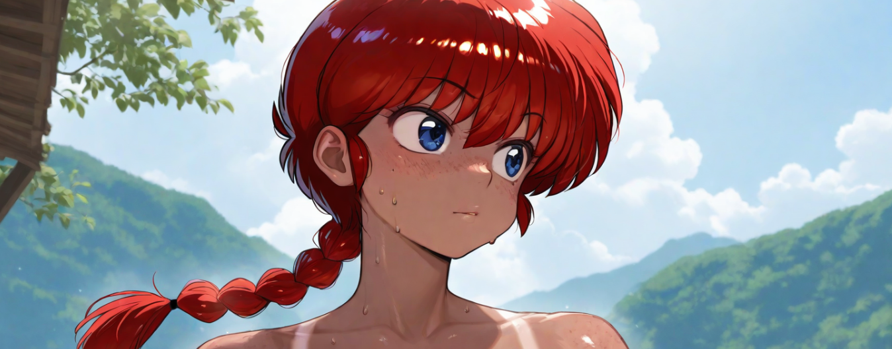

  
   
  

    <h2 class="text-small" style="text-align:center">Ranma-chan [NSFW] Theme</h2>
    
MNSFW Theme inspired by Ranma 1/2

     
    
      

        <a href="https://github.com/The-Back-Room/Ranma-chan-NSFW-Theme/archive/refs/heads/main.zip" target="_blank">
          <button type="button" name="button" class="btn">Download</button></a> 
      

    
     
  

