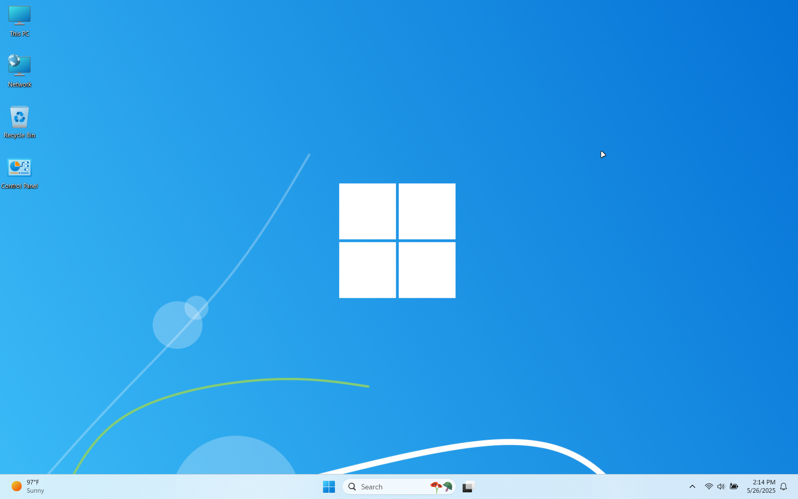

<!-- 
{: .note }
> {: .opaque }
> 
>
> 
-->

  
   
  

    <h2 class="text-small" style="text-align:center">Classic 11</h2>
    
Simple Windows 11 theme with a classic style reminiscent of the Windows 7 era

     
    
      

        <a href="https://gitlab.com/the-back-room/Themes/-/archive/main/Themes-main.zip?path=Windows/SFW/Classic-11" target="_blank">
          <button type="button" name="button" class="btn">Download</button></a> 
      

    
     
  

