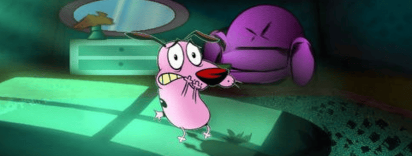

  
   
  

    <h2 class="text-small" style="text-align:center">Courage TCD</h2>
    
A tribute to a cult classic from the early to late 90s

     
    
      

        <a href="https://gitlab.com/the-back-room/Themes/-/archive/main/Themes-main.zip?path=Windows/SFW/Courage-TCD" target="_blank">
          <button type="button" name="button" class="btn">Download</button></a> 
      

    
     
  

