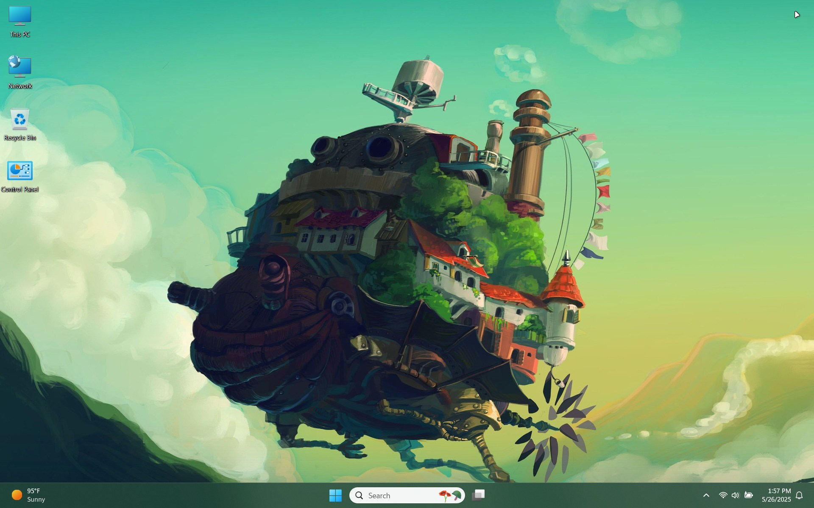

<!-- 
{: .note }
> {: .opaque }
> 
> 
> 
-->

  
   
  

    <h2 class="text-small" style="text-align:center">Howl's Moving Castle</h2>
    
A tribute to one of Studio Ghibli's highest grossing films

     
    
      

        <a href="https://gitlab.com/the-back-room/Themes/-/archive/main/Themes-main.zip?path=Windows/SFW/Howls-Moving-Castle" target="_blank">
          <button type="button" name="button" class="btn">Download</button></a> 
      

    
     
  

