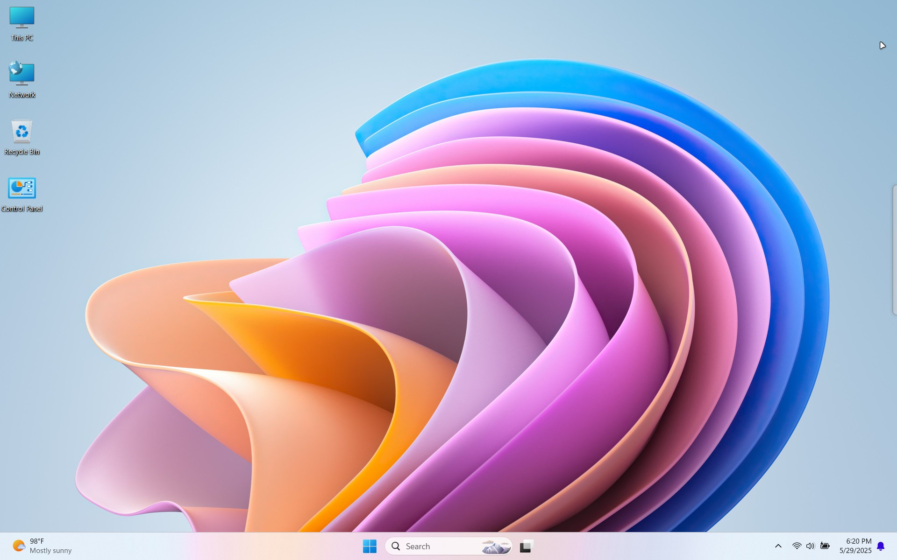
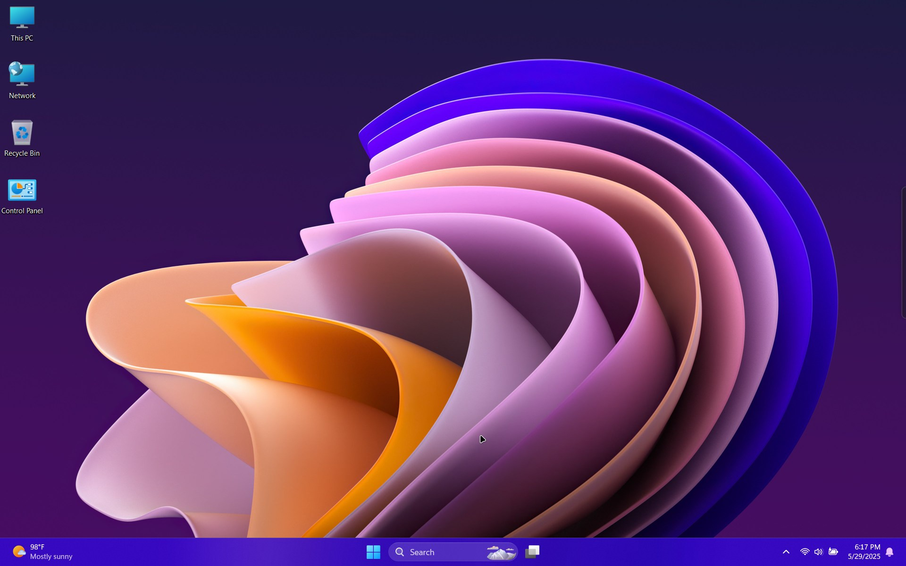
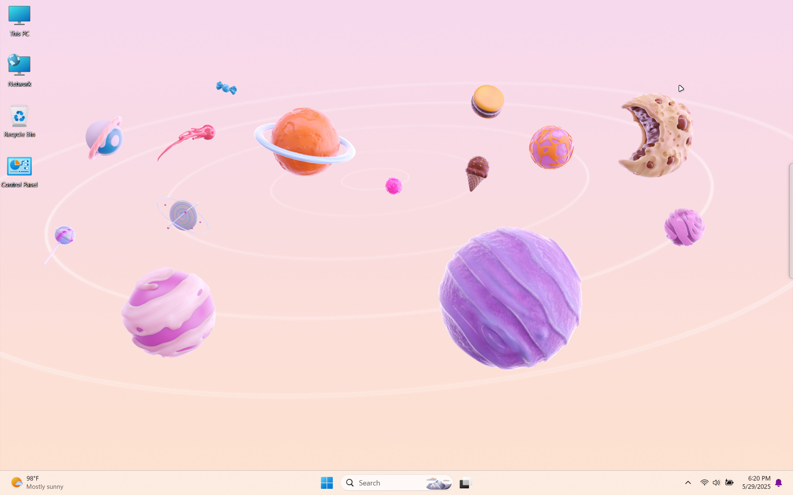
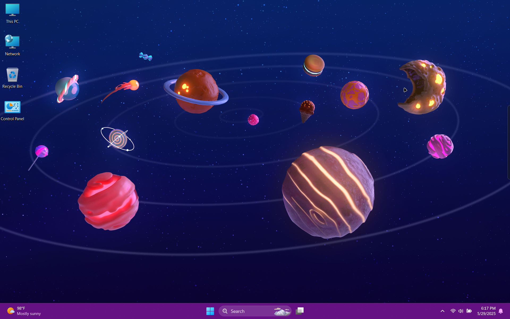
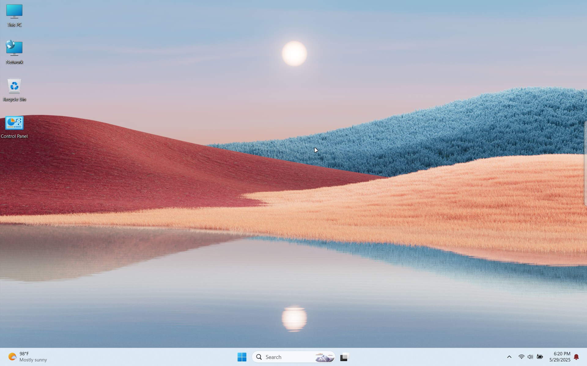
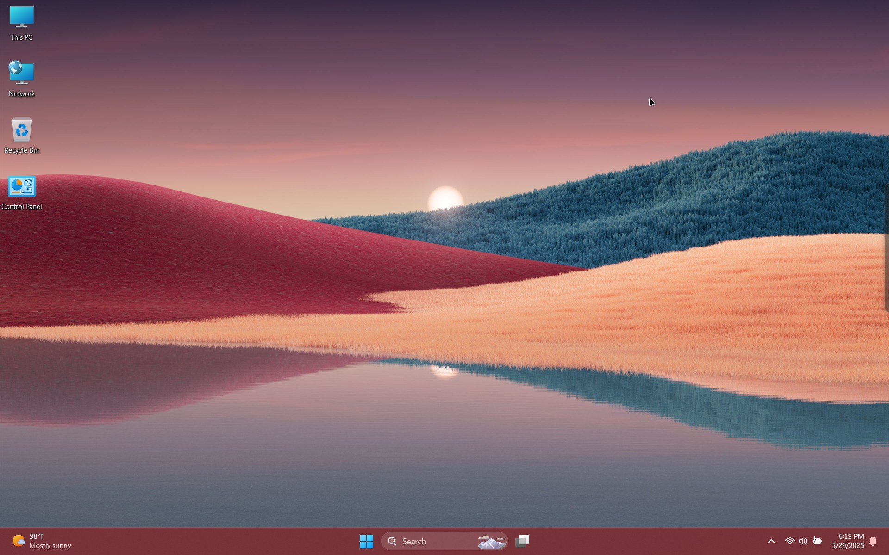

<!-- 
{: .note }
> {: .opaque }
> 
>
> 
-->

    

    

      
1 / 6

      
      
Flower (light)

    

    

      
2 / 6

      
      
Flower (dark)

    

      
3 / 6

      
      
Planets (light)

    

    

      
4 / 6

      
      
Planets (dark)

    

      
5 / 6

      
      
Sunset (light)

    

    

      
6 / 6

      
      
Sunset (dark)

    

  

  

     
    
     
    
     
    
  

  

    <h2 class="text-small" style="text-align:center">Windows 11 Hidden EDU Themes</h2>
    
Windows 11 Hidden EDU Themes for all to enjoy.

     
    
      

        <a href="https://gitlab.com/the-back-room/Themes/-/archive/main/Themes-main.zip?path=Windows/SFW/Windows-11-Hidden-EDU-Themes" target="_blank">
          <button type="button" name="button" class="btn">Download</button></a> 
      

    
     
  

