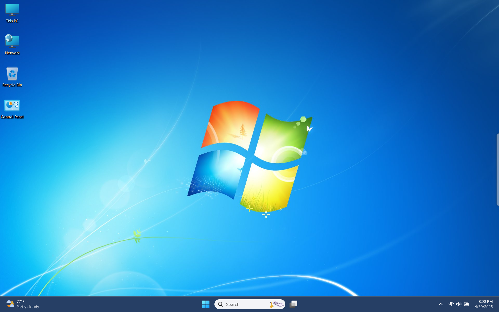

  
   
  

    <h2 class="text-small" style="text-align:center">Windows 7 Themes Revived</h2>
    
Windows 7 themes ported to Windows 11

     
    
      

        <a href="https://github.com/The-Back-Room/Windows-7-Themes-Revived/archive/refs/heads/main.zip" target="_blank">
          <button type="button" name="button" class="btn">Download</button></a> 
      

    
     
  

